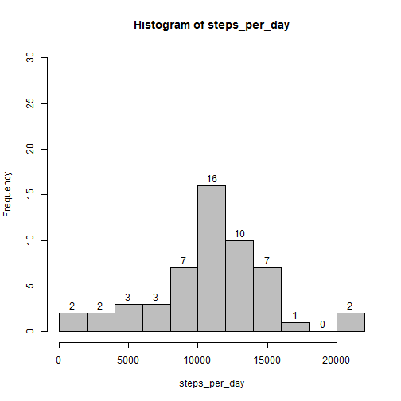
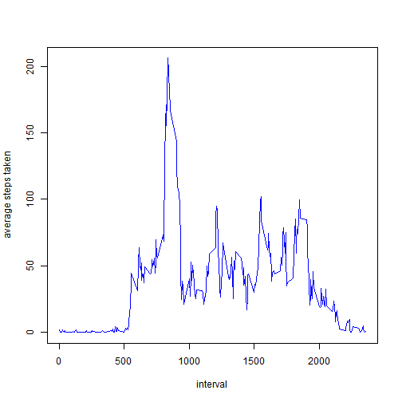
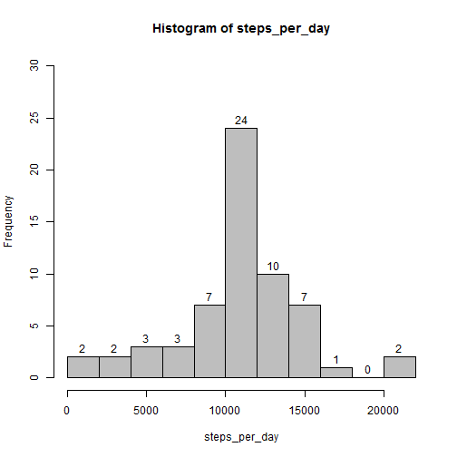
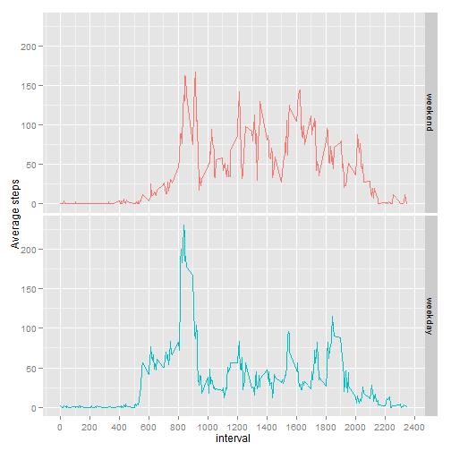

## Loading and preprocessing the data

1. Load the data (i.e. read.csv())

    
    ```r
    # Load the required packages
    usePackage <- function(p) {
      if (!suppressPackageStartupMessages(require(p, character.only = TRUE)))
        install.packages(p)
      suppressPackageStartupMessages(library(p,character.only=TRUE))
    }
    
    usePackage("lubridate") # Lubridate provides tools that make it easier to parse and manipulate dates.
    usePackage("dplyr")     # A fast, consistent tool for working with data frame like objects.
    usePackage("ggplot2")   # Grammer of Graphics
    usePackage("scales")    # Scale functions for graphics, for nicer yticks
    
    # If the activity variable doesn't exist, load it
    if (!exists("activity")) {
      
      zipfile <- "activity.zip"       
      file <- "activity.csv"
      
      # Unzip the data if it doesn't exist yet
      if (!file.exists(file)){
        unzip(zipfile)
      }
      
      # Read the file  
      activity <- read.csv(file, header = TRUE, as.is = TRUE)        
    }
    ```
2. Process/transform the data (if necessary) into a format suitable for your analysis

    
    ```r
      # Convert the date to a POSIXct object  
      activity$date <- ymd(activity$date)
    ```
    
## What is mean total number of steps taken per day?

1. Make a histogram of the total number of steps taken each day
 
    
    ```r
    activity_day <- activity %>%
      group_by(date) %>%
      summarize(steps_per_day=sum(steps)) #don't ignore NA with na.rm=TRUE, then the sum will be zero
    
    with(activity_day,hist(steps_per_day,breaks=10, col="grey", labels = TRUE, ylim=c(0, 30)))
    ```
    
     
      
2. Calculate and report the mean and median total number of steps taken per day

    The mean and median total number of steps taken per day are:
      
    
    ```r
    mean(activity_day$steps_per_day,na.rm=T)
    ```
    
    ```
    ## [1] 10766.19
    ```
    
    ```r
    median(activity_day$steps_per_day,na.rm=T)
    ```
    
    ```
    ## [1] 10765
    ```


## What is the average daily activity pattern?

1. Make a time series plot (i.e. type = "l") of the 5-minute interval (x-axis) and the average number of steps taken, averaged across all days (y-axis)

    
    ```r
    activity_interval <- activity %>%
      group_by(interval) %>%
      summarize(mean=mean(steps, na.rm=TRUE)) 
    
    with(activity_interval,plot(interval,mean,type = "l",col="blue",ylab="average steps taken"))
    ```
    
     

2. Which 5-minute interval, on average across all the days in the dataset, contains the maximum number of steps?

    
    ```r
    activity_interval %>% filter(mean==max(mean))
    ```
    
    ```
    ## Source: local data frame [1 x 2]
    ## 
    ##   interval     mean
    ## 1      835 206.1698
    ```
    
    The 835 interval contains, on average across all the days in the dataset, the maximum number of steps (206).


## Imputing missing values

1. Calculate and report the total number of missing values in the dataset (i.e. the total number of rows with NAs)
    
    ```r
    missing <- activity %>%
      group_by(date) %>%
      summarize(NAcount=sum(is.na(steps))) %>%
      filter(NAcount>0)
    
    missing
    ```
    
    ```
    ## Source: local data frame [8 x 2]
    ## 
    ##         date NAcount
    ## 1 2012-10-01     288
    ## 2 2012-10-08     288
    ## 3 2012-11-01     288
    ## 4 2012-11-04     288
    ## 5 2012-11-09     288
    ## 6 2012-11-10     288
    ## 7 2012-11-14     288
    ## 8 2012-11-30     288
    ```
    
    ```r
    sum(missing$NAcount)
    ```
    
    ```
    ## [1] 2304
    ```
    
    There are 8 days on which 288 intervals are missing, so in total there are 2304 rows with `NA`s.

2. Devise a strategy for filling in all of the missing values in the dataset. The strategy does not need to be sophisticated. For example, you could use the mean/median for that day, or the mean for that 5-minute interval, etc.

    The strategy to fill in all missing values in the dataset is to replace them with the mean for that 5-minute interval.

3. Create a new dataset that is equal to the original dataset but with the missing data filled in.

    
    ```r
    activity_nomissing <- activity %>% 
      group_by(interval) %>%
      mutate(steps = replace(steps, is.na(steps), mean(steps, na.rm=TRUE)))        
    ```

4. Make a histogram of the total number of steps taken each day and Calculate and report the mean and median total number of steps taken per day. Do these values differ from the estimates from the first part of the assignment? What is the impact of imputing missing data on the estimates of the total daily number of steps?

    
    ```r
    activity_day_nomissing <- activity_nomissing %>%
      group_by(date) %>%
      summarize(steps_per_day=sum(steps))
    
    with(activity_day_nomissing,hist(steps_per_day,breaks=10, col="gray", labels = TRUE, ylim=c(0, 30)))
    ```
    
     
    
    
    ```r
    mean(activity_day_nomissing$steps_per_day)
    ```
    
    ```
    ## [1] 10766.19
    ```
    
    ```r
    median(activity_day_nomissing$steps_per_day)
    ```
    
    ```
    ## [1] 10766.19
    ```

    The mean remains the same as before imputing (10766.19), because we impute with the mean. We impute eight days with exactly the same values (average sum of the total number of steps taken per day), so this value also becomes the median (the usual average).
    
    The impact on the histogram is that the frequency of the bin that contains the imputing mean value (10766.19, in this histogram the bin from 10000 to 12000) increases with 8, from 16 to 24.

## Are there differences in activity patterns between weekdays and weekends?

1. Create a new factor variable in the dataset with two levels -- "weekday" and "weekend" indicating whether a given date is a weekday or weekend day.


    
    ```r
    activity_interval_nomissing <- activity_nomissing %>%
      mutate(day = factor(is.element(wday(date, label=T),c("Sat","Sun")),levels=c(T,F),labels=c("weekend","weekday")))  %>%
      group_by(interval,day) %>%  
      summarize(mean=mean(steps, na.rm=TRUE)) 
    ```

2. Make a panel plot containing a time series plot (i.e. type = "l") of the 5-minute interval (x-axis) and the average number of steps taken, averaged across all weekday days or weekend days (y-axis). 
      
    
    ```r
    ggplot(data=activity_interval_nomissing,aes(x=interval,y=mean,color=day)) +
      geom_line() + 
      scale_x_continuous(breaks=pretty_breaks(n=10)) +  
      ylab("Average steps") +
      facet_grid(day ~ .) + theme(legend.position="none") 
    ```
    
     
    
    The average number of steps in the weekend increases later in the weekend and is on higher in the afternoon, compared to the weekdays. During weekdays there are more average steps around 8:35 and 18:45.
